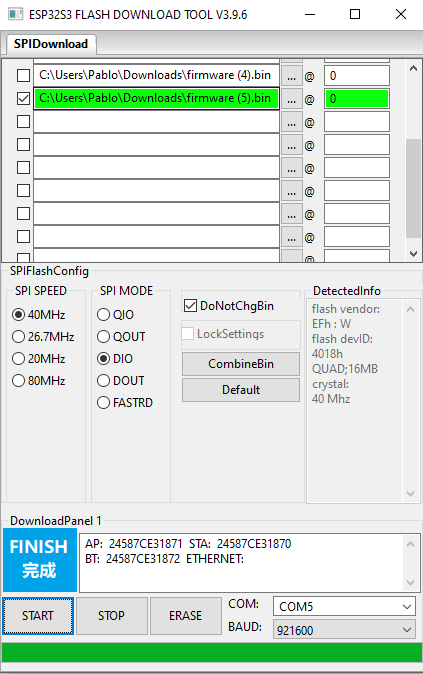
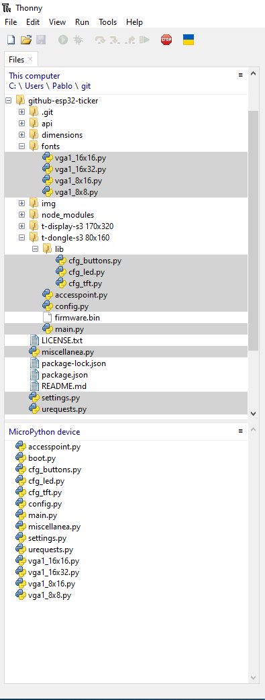

<h1 align = "center"> 🌟Github Contributions Ticker🌟</h1>

# 0️⃣ Introduction
This project contains all the necessary code to build an ESP32 based ticker, that downloads the github contributions and statistics from the github GraphQL API and displays them in an LCD screen.

I have coded 2 versions for which the code is available in this very same repo:

1.- a 0.96" usb dongle version with no contributions matrix, displays the stats and user avatar only. It has a back led for which the color can be changed. Single button to navigate through the menu.

2.- a 1.9" battery powered version that displays a main screen (stats + user avatar) and the github contributions matrix in quarters. It doesn't have a configurable led, but features 2 buttons to navigate through the UI and the menu.

This readme will walk you through the whole set up process of all the components: the node.js backend server, the api token generation and the firmware flashing.

You can see it in action [here](https://www.youtube.com/watch?v=hwvotBVL1M0).

# 1️⃣  Requirements
You will need all the following to complete the installation and setup the device:

- While all the data used is publicly available and can be checked for any github user you want, you'll need a github API KEY to fetch the data. This is detailed in section 3

- A Lilygo T-Dongle-S3 (80x160) or T-Display-S3 (170x320). You can get them using the links from section 2

   * You can also incorporate a li-po batttery for the T-Display-S3 but is optional, as you can power it using any usb-c cable

   * Also, you can buy the shell version of the T-Display-S3 or you can print your own shell with the stl files from the folder called "dimensions"

- A backend server to retrieve all the data, and serve them as json files. I have used a node.js server deployed in vercel which is free. Configuration is described in section 4

- Finally flash the devices as shown in section 5 with one of the methods described in sections 6, 7, 8:
   * Option A: Flash the micropython custom firmware and manually upload the code
   * Option B: Compile the custom micropython firmware together with python files and flash the binaries
   * Option C: Flash the provided binaries in folder "firmware" [recommended]

# 2️⃣ Shopping List
If you want to support the project, you can use the affiliate links down below to purchase the PCB's and batteries:

| Product             | SOC        | Flash | Resolution | Size     | Driver   | Link                        |
| ------------------- | ---------- | ----- | ---------- | -------- | -------- | --------------------------- |
| T-Dongle-S3         | ESP32-S3R8 | 16MB  | 80x160     | 0.96"    | ST7735   | [Amazon][1] [Aliexpress][2] |
| T-Display-S3        | ESP32-S3R8 | 16MB  | 170x320    | 1.9"     | ST7789   | [Amazon][3] [Aliexpress][4] |

[1]: https://www.amazon.es/LILYGO-T-Dongle-S3-ESP32-S3-TTGO-desarrollo/dp/B0BK9162QY?__mk_es_ES=%C3%85M%C3%85%C5%BD%C3%95%C3%91&crid=N3LQI2M2TN5E&dib=eyJ2IjoiMSJ9.BYaX7vXkqhGvhd3yw6Ziv1-eDHFBfpblIpIMscrqNJnGZeKh_IbOrQeMaBx1tiX-03__jCZEgcqJBgScT57qOhc5HhMx9yq-CQqX7F1qONa20Mh6kucYNDz5VlYWiICGq8DGZ8khpWRedJ63Do_NFbFUqyj1Th7McyAU9-9BNUgnHKiOf9F9ChdFVOVMdtEQoof2RSF40sHPyavbGx9xX5mgpiH7uL6CrgGzbZitcN2pPLNBh1NC4IIY-h8u57tDC3DgfD9WO0lZZfr7ksY3f5BqVfUsu-zLS89hqZWaP6A.c4EnrHQHYCjopMnzupT4dA0d_A-JV0zu1w0_7RO19hI&dib_tag=se&keywords=t-dongle-s3&qid=1720687272&sprefix=t-dongle-s3%2Caps%2C86&sr=8-5&linkCode=ll1&tag=pablogonmo-21&linkId=6b0d27fdcc7d13170b14b958a1171ea4&language=es_ES&ref_=as_li_ss_tl
[2]: https://s.click.aliexpress.com/e/_DFBhdlv
[3]: https://www.amazon.es/LILYGO-T-Display-S3-ESP32-S3-Pantalla-pantalla/dp/B0BRTT727Z?pd_rd_w=dSnuH&content-id=amzn1.sym.5a7a6d63-cd04-4577-9171-c9c301e99efe&pf_rd_p=5a7a6d63-cd04-4577-9171-c9c301e99efe&pf_rd_r=2KGQ89F94VK68EFZWZMH&pd_rd_wg=VKAlg&pd_rd_r=8cb3170a-8dfe-405a-b784-f65abf0ca9c0&pd_rd_i=B0BRTT727Z&psc=1&linkCode=ll1&tag=pablogonmo-21&linkId=9172082af6eecabbd18680fafe0253f3&language=es_ES&ref_=as_li_ss_tl
[4]: https://s.click.aliexpress.com/e/_DDZzBuB

Remember to choose the LCD version for the t-dongle-s3
Remember to choose the non-touch+shell version for the t-display-s3

| Product             | Capacity | Voltage | Measurements |
| ------------------- | -------- | ------- | ------------ |
| [Battery][5]        | 200mAh   | 3.7V    | 3x25x30 mm   |

[5]: https://es.aliexpress.com/item/4001059908660.html

# 3️⃣ Generating a Github personal access token
The back-end server fetches the source data from github directly by means of the graphQL API which is publicly available. The only required is a personal access token which can be generated following the steps:

1.- Go to your github account settings

2.- Under Developer Settings > Personal Access Tokens > Personal access tokens (classic) https://github.com/settings/tokens

3.- Click on generate new token, classic for general use

4.- Set a wide expiration date, and grant the minimum permissions, usually read, user and repo should be sufficient

# 4️⃣  Back-End server installation
You'll need to set up a back-end to fetch the github data and for the device to retrieve it. I used a vercel instance which is free and you can connect it to the github repo and deploy the code automatically.

After that you'll need to set an environment variable up called GITHUB_TOKEN, and set the value of the personal access token defined in step 3.

Then deploy the files:

api/*

img/*

node_modules/*

package.json

package-lock.json

If everything goes well, you should be able to see data at: https://yourproject.vercel.app/api/githubData?username=yourusername

Once the back end server is up and running, you have 2 choices:
- flash the device with a micropython firmware, manually upload the code and run it
- compile the code to generate a custom micropython firmware with the display drivers, then flash it
- flash the firmware available in the "firmware" folder from this repo

# 5️⃣  Flash a firmware

Disclaimer: remember to change the URL in the main.py file so you can connect to your recently created back-end.

To flash a firmware, follow the steps:

1.- open the flash_download_tool_3.9.6 [download](https://www.espressif.com/sites/default/files/tools/flash_download_tool_3.9.7_2.zip)

2.- connect the device in boot mode

3.- select ESP32-S3 / Develop / USB

4.- Check the tickbox, look for the firmware you want to flash and write direction "@" 0. Then: SPI Mode: DIO, SPI Speed: 40 Mhz, COM: your_COM, BAUD: 921600

5-. Click "Erase" and wait for it to finish (will show in blue). Then click "Start" and again let it finish

6.- Once finished, click "Stop" and re-plug the device (don't boot mode it this time)

# 6️⃣  Option A: Flash the micropython custom firmware and manually upload the code

Download the micropython firmware for [T-Dongle-S3](https://github.com/mmMicky/st7735_mpy/blob/master/firmware/GENERIAL_S3/firmware.bin) or [T-Display-S3](https://github.com/russhughes/st7789s3_mpy/blob/main/firmware/firmware.bin) and flash it following the steps in section 5.

Once flashed the micropython firmware, you can upload the micropython code directly by using any IDE that supports python and espressif devices:
- You can use VSCode or Thonny (recommended)
- Once installed, connect to the device and upload all the .py files from the root of this repo, the fonts folder and the python files from the specific folder for your device. Here's how you want to upload the files: 

- Reboot the device and follow the steps in section 9

# 7️⃣  Option B: Compile the custom micropython firmware together with python files and flash the binaries
This is out of the scope of this guide and not recommended as micropython/espressif are constantly evolving and newer versions might not work.

Just for the record, I myself managed to successfully compile the binaries using:
   * Dongle-s3: Ubuntu 22.04.4 LTS, micropython v1.19, esp-idf v4.4 
   * Display-s3: Debian 12.5, micropyton v1.23.0, esp-idf v5.2.2

If you still want to go down this route, you can follow the [guide](https://github.com/micropython/micropython/blob/master/ports/esp32/README.md#setting-up-esp-idf-and-the-build-environment)

# 8️⃣  Option C: Flash the provided binaries in folder "firmware" [recommended]
This is the easiest and quickest option to get your github ticker up and running. Simply flash the firmware using steps from section 5. Then continue to configure the device as described in section 9.

Disclaimer:
- The compiled code connects to my back-end server
- At the moment of writing this guide is up and running and free for anyone to use it but there's no warranty I will maintain it
- No data is logged, apart from 1hr of the backend access runtime logs in vercel
- Use it at your own convenience if you like, or compile the code after prior verification

# 9️⃣  Configure the Device
Once flashed the code and booted, the device will show a black screen with an IP. It has created a WIFI access point called "GITHUB_TICKER" for you to connect to it (passwordless). 

Once connected open a web browser and go to 192.168.4.1

It will load a plain html page where you can input your WIFI (so the device can connect to your back-end server, but of course not send to the backend) and github user. 

After submitting, the device will reboot and start downloading all the data (if not, simply plug it in again).

You can watch the configuration steps [here](https://www.youtube.com/watch?v=hwvotBVL1M0&t=34s).

# 1️⃣0️⃣  FAQ
1. **There are 2 versions of the T-Dongle-S3, which one should I choose?**
   * The one with the LCD screen. Contact me on twitter in case of doubt

2. **There are 2 versions of the T-Display-S3, which one should I choose?**
   * The non-touch version. Either with the shell or print it yourself with the files provided in the dimensions folder. Contact me on twitter in case of doubt

3. **I can't flash the device with the micropython firmware**
   * If you followed the steps above it should work correctly and you should be able to connect to the device and execute python code with VSCode or Thonny (recommended). Otherwise contact me on twitter if you can't make it work

4. **I can't upload any sketch or flash the device**
   * Connect the board via the USB cable
   * Press and hold the **BOOT** button , While still pressing the **BOOT** button
   * Press **RST** button
   * Release the **RST** button
   * Release the **BOOT** button (If there is no **BOOT** button, disconnect IO0 from GND.)
   * Upload the code
   * Press the **RST** button to exit download mode

5. **If all the above are invalid, please flash the factory firmware for quick verification, please check [here](https://github.com/Xinyuan-LilyGO/T-Display-S3/blob/main/firmware/README.MD)**

6. **I can't connect to the device plugging it in my laptop**
   * Make sure is not in boot mode
   * If not, try reflashing the micropython firmware
   
7. **I can connect to the device but can't execute any python code**
   * Make sure you're not in boot mode, pt. 4

8. **The backend server has stopped working and doesn't retrieve data**
   * Double check the environment variable is still correctly set up
   * If so, double check the personal access token hasn't expired, if so regenerate it and set it up on vercel. Then redeploy the code

9. **I followed all the steps and configurd the wifi ssid/password, but it doesn't bootload**
   * Poor wifi connection might be the cause, try to get closer to your wifi router or connect the device to a mobile phone access point to test connection

# 1️⃣1️⃣  Attributions
The following repositories have been used to build this project:
 
@Xinyuan-LilyGO hardware repos:
- https://github.com/Xinyuan-LilyGO/T-Dongle-S3/blob/main/image/Pins.png
- https://github.com/Xinyuan-LilyGO/T-Display-S3/blob/main/image/T-DISPLAY-S3.jpg

Drivers for the displays:
- @russhughes (T-Display-S3): https://github.com/russhughes/st7789s3_mpy
- @mmMicky(T-Dongle-S3): https://github.com/mmMicky/st7735_mpy

@espressif: https://github.com/espressif/esp-idf

@micropython: https://github.com/micropython/micropython

# 1️⃣2️⃣  Buy me a coffee
If you liked this project and want to support me, you can buy me a coffee:

☕ https://buymeacoffee.com/pablogonmo
